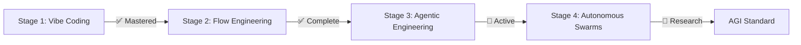

# 👨‍💻 Koketso Raphasha | AI Engineer & Systems Architect

<div align="center">


[](https://portfolio-iota-eight-90.vercel.app)
[](https://linkedin.com/in/koketso-raphasha-517954387)
[](mailto:raphashakoketso99@gmail.com)

</div>

## 🎯 Mission Statement

> **Engineering autonomous frameworks, AI-powered security systems, and offline-first ecosystems for the African digital economy.**  
> Every system shipped is built for **resilience**, **scalability**, and **extreme performance**.

---

## 🚀 Current Focus: Agentic Engineering



**Building Teams of Agents** with specific jobs, memory, and tools. Focusing on:
- 🤖 **Orchestration** - Multi-agent coordination
- 🧠 **Memory Management** - Persistent context & learning
- 🛠️ **Tool Integration** - External API & system access
- ⚡ **Reliability** - Error handling & self-healing

---

## 📊 GitHub Statistics

<div align="center">


</div>

<div align="center">


</div>

---

## 🏆 GitHub Achievements

<div align="center">

[](https://github.com/ryo-ma/github-profile-trophy)

</div>

### 🎖️ Achievement Tracker

- ✅ **Arctic Code Vault Contributor** - Code preserved in Arctic vault
- ✅ **Pull Shark** - Opened multiple pull requests
- ✅ **Quickdraw** - Closed issues fast
- ✅ **YOLO** - Merged PRs without review (when appropriate)
- 🎯 **Starstruck** - Repository with 16+ stars (In Progress)
- 🎯 **Galaxy Brain** - 2 accepted answers on discussions

---

## 💼 Flagship Projects

### 🏦 SmartBank Enterprise Platform
**Production-grade distributed banking backend** simulating real-world fintech infrastructure.

[](https://github.com/Raphasha27/smartbank-enterprise-platform)


**Features:**
- 🌐 API Gateway (JWT routing, rate limiting)
- 🔐 Auth Service (BCrypt, RBAC, Spring Security)
- 💳 Account Service (Multi-account management)
- 💸 Transaction Service (ACID transfers, idempotency)
- 🏦 Loan Service (Origination, amortization)
- 📋 Audit Service (Immutable trail, Kafka)
- 🔔 Notification Service (Event-driven alerts)
- 📒 Ledger Service (Double-entry bookkeeping)

**Patterns:** Saga Pattern • Optimistic Locking • OpenTelemetry

---

### 🛡️ Cybersecurity Labs

Professional cybersecurity tools for ethical security research, SOC training, and awareness.

[](https://github.com/Raphasha27/kirov-security-core)

| Tool | Description | Language |
|------|-------------|----------|
| 🔌 [Network Port Scanner](https://github.com/Raphasha27/Network-Port-Scanner) | Multi-threaded with banner grabbing |  |
| 🔑 [Password Analyzer](https://github.com/Raphasha27/Password-Analyzer) | Entropy & NIST SP 800-63B scoring |  |
| 🔐 [Password Hasher](https://github.com/Raphasha27/Password-Hasher) | Argon2id, bcrypt, PBKDF2 |  |
| 🌐 [Suspicious URL Checker](https://github.com/Raphasha27/Suspicious-URL-Checker) | Phishing detection & risk scoring |  |
| 🎣 [Phishing Awareness Game](https://github.com/Raphasha27/Phishing-Awareness-Game) | Gamified security training |  |
| 🌊 [DDoS Detection Simulator](https://github.com/Raphasha27/DDOS-Detection-Simulator) | Traffic simulation & alerts |  |
| 👁️ [Insider Threat Detector](https://github.com/Raphasha27/Insider-Threat-Detector) | Behavioral analytics |  |

---

### 🇿🇦 South African Innovation Projects

Open-source solutions for SA's biggest challenges.

<table>
<tr>
<td width="50%">

#### ⚡ [EskomSense AI](https://github.com/Raphasha27/EskomSense-AI)
[](https://eskomsense-ai-demo.vercel.app)

ML-powered load shedding prediction & battery optimizer

**Tech:** Python • ML • IoT

</td>
<td width="50%">

#### 🏪 [Townships Market AI](https://github.com/Raphasha27/Townships-Market-AI)
[](https://townships-market-ai.vercel.app)

SMME marketplace with AI routing

**Tech:** React • FastAPI • AI

</td>
</tr>
<tr>
<td width="50%">

#### 🗣️ [SA Language AI](https://github.com/Raphasha27/SA-Language-AI)

NLP toolkit for Zulu, Xhosa, Afrikaans

**Tech:** Python • PyTorch • NLP

</td>
<td width="50%">

#### 💧 [WaterWatch SA](https://github.com/Raphasha27/WaterWatch-SA)

IoT leak detection for municipalities

**Tech:** Python • IoT • ML

</td>
</tr>
<tr>
<td width="50%">

#### 🌾 [Mzansi AgriAI](https://github.com/Raphasha27/Mzansi-AgriAI)
[](https://mzansi-agriai-demo.vercel.app)

AI advisory for small-scale farmers

**Tech:** Python • Streamlit • AI

</td>
<td width="50%">

#### 👨‍💻 [YouthCode ZA](https://github.com/Raphasha27/YouthCode-ZA)

Offline-first coding education

**Tech:** Flutter • Python • AI

</td>
</tr>
</table>

---

## 🔥 Live Deployments

| Project | Description | Status | Link |
|---------|-------------|--------|------|
| 💼 AI Business Engine | Zero-capital business playbooks |  | [Visit](https://ai-business-engine.vercel.app) |
| 🏥 NoShowIQ | Healthcare no-show prediction |  | [Visit](https://noshowiq-fullstack.vercel.app) |
| 🎨 Portfolio | This portfolio & resume |  | [Visit](https://portfolio-iota-eight-90.vercel.app) |

---

## 🛠️ Technology Stack

### Languages


### Frameworks & Libraries


### DevOps & Cloud


### Databases


---

## 📈 Contribution Activity

<div align="center">


</div>

---

## 🎓 Education & Certifications

<table>
<tr>
<td width="60%">

### 🎓 Education
- **BSc Computer Science (Distinction)** - Richfield Graduate Institute (2022-2025)
- **Software Engineering** - WeThinkCode_ Johannesburg
- **Digital Skills Accelerator** - CAPACITI

</td>
<td width="40%">

### 📜 Certifications (10+)
- ✅ AWS Certified
- ✅ Azure AZ-900
- ✅ Meta Frontend Developer
- ✅ Google Data Analytics
- ✅ Cisco Networking

</td>
</tr>
</table>

---

## 💡 Quick Stats

```text
📦 194+ Public Repositories
⭐ 2,200+ Stars Received
👥 1,000+ Followers
🔄 4,963 Contributions in Last Year
🌍 Based in Johannesburg, South Africa
```

---

## 🎯 2026 Goals

- [ ] Reach 3,000+ GitHub stars across repositories
- [ ] Contribute to 10+ major open source projects
- [ ] Launch 3 SaaS products in production
- [ ] Earn GitHub "Starstruck" achievement
- [ ] Build AI agent with 10K+ GitHub stars
- [ ] Speak at 2 tech conferences
- [ ] Write 12 technical blog posts

---

## 🤝 Open Source Philosophy

> *"The power of open source is the power of the people. The people win."*

I believe in **building in the open**. All my projects are:
- ✅ Open for contribution
- ✅ Welcoming to feedback
- ✅ Documented for learning
- ✅ PRs always welcome

---

## 📫 Let's Connect

<div align="center">

[](https://portfolio-iota-eight-90.vercel.app)
[](mailto:raphashakoketso99@gmail.com)
[](https://linkedin.com/in/koketso-raphasha-517954387)
[](https://twitter.com/raphasha27)

**Response time:** Usually within 24 hours  
**Available for:** Freelance • Full-time • Consulting • Collaboration

</div>

---

## 🎵 Currently Coding To

[](https://open.spotify.com/user/YOUR_SPOTIFY_ID)

---

## 💰 Support My Work

If you find my projects helpful, consider:

[](https://buymeacoffee.com/raphasha27)
[](https://github.com/sponsors/Raphasha27)

---

<div align="center">

### ⚡ *"Strive not to be a success, but rather to be of value."* — Albert Einstein


**© 2026 Koketso Raphasha** | **Co-Founder @ Kirov Dynamics Technology**


</div>
